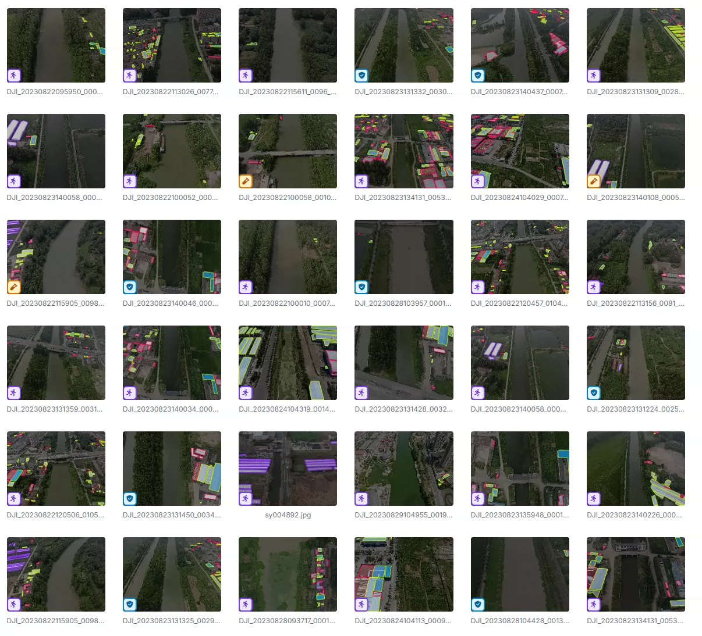
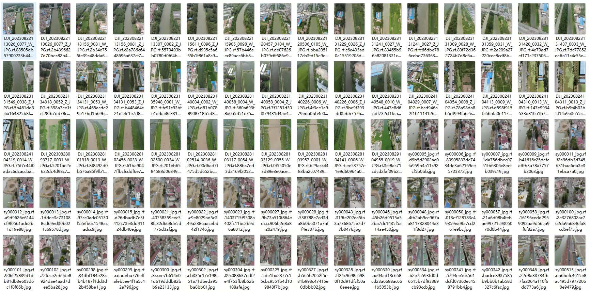
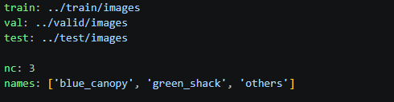
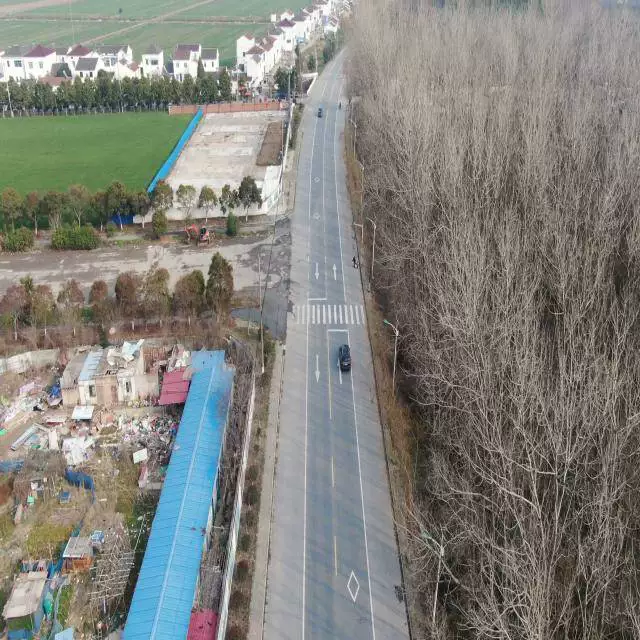
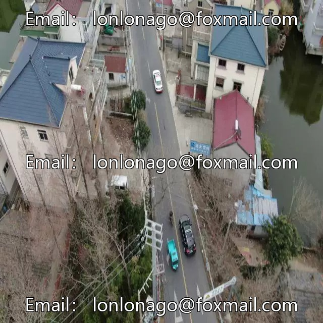
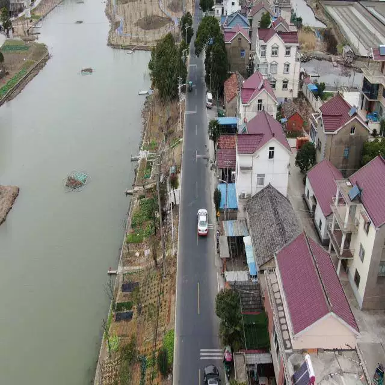

## Body

UAV, Ground-to-Air, Agricultural Building Greenhouse Identification Dataset in YOLO format

Totally 1184 images are available, each labeled with its corresponding category.
The dataset is divided into three categories: 'blue_canopy', 'green_shack', 'others'
‘Blue canopy’, ‘Green shack’, ‘Others’

The dataset has been well organized into training set, test set, and validation set.

Electronic virtual products sold cannot be returned or exchanged.

## Images

item_1037053083730

Here is a pay link on Stripe ( https://buy.stripe.com/3cs8yP7sY87d0vu9AB ). Please contact me lonlonago@foxmail.com after funding $89, and I will send you a complete data files , thank you!

